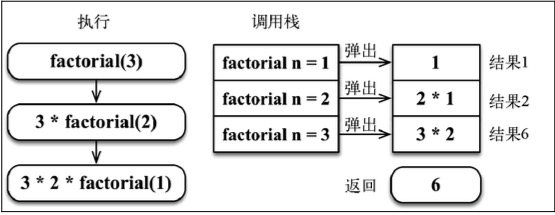

## 递归三要素

递归的定义: 接受什么参数, 返回什么值, 代表什么意思. 当函数直接或者间接调⽤⾃⼰时, 则发⽣了递归

递归的拆解: 每次递归都是为了让问题规模变⼩

递归的出⼝: 必须有⼀个明确的结束条件. 因为递归就是有"递"有"归", 所以必须又有一个明确的点, 到了这个点, 就不用"递下去", 而是开始"归来".

## 三个经典递归案例

### 斐波那契数列

关于斐波那契数的各种花式玩法, 可参考[动态规划](/algorithm-design/dynamic-programming#从斐波那契数列说起).

```ts
export const fibonacci1 = (n: number) => {
  if (n === 0 || n === 1) return n
  return fibonacci1(n - 1) + fibonacci1(n - 2)
}
```

### 汉诺塔

```ts
let times = 0
function hanoi(n: number, A: string, B: string, C: string) {
  if (n > 1) {
    // 把 A 上的 n-1 个圆盘借助辅助塔 C 由 A 移到 B
    hanoi(n - 1, A, C, B)
    // 把 n 号(即最大的那个)由 A 移到 C
    hanoi(1, A, B, C)
    // 把B上的 n-1 个圆盘借助辅助塔(A塔)由 B 移到 C
    hanoi(n - 1, B, A, C)
  } else {
    console.log(`第${++times}次移动: ${n}号盘从${A}移动到${C}`)
  }
}
hanoi(3, 'A', 'B', 'C')
```

### 兔子繁殖

有一对兔几, 从第四个月起每月生一对兔几, 新生的这对兔几从第四个月起每月又生一对兔几, 在 n 个月内会有多少对兔几.

```ts
function rabbitBreeding(n: number) {
  if (n === 1) return n
  return rabbitBreeding(n - 1) * 2
}

// 这道题如果把 2 换成 n, 就成了阶乘的算法
function factorial(n: number) {
  if (n === 1) return n
  return factorial(n - 1) * n
}
```

## 调用栈图解


