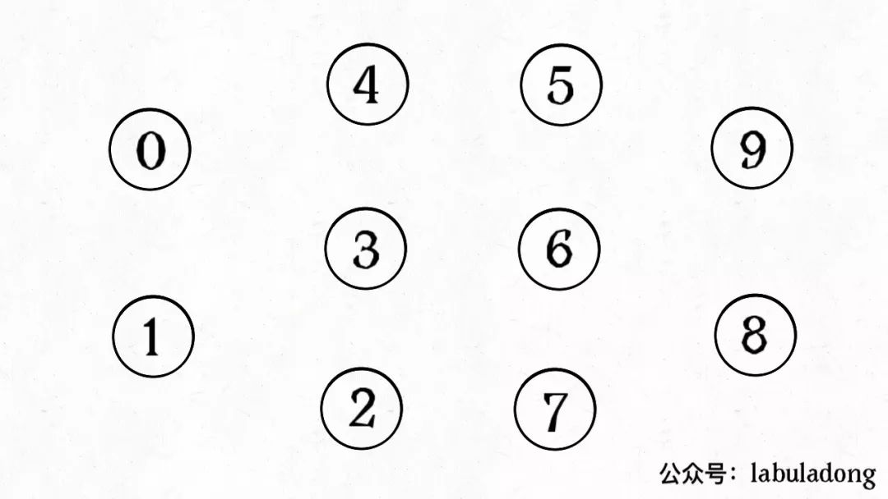

## 概念

并查集算法, 主要是解决图论中的**动态连通性**. 简单说, 动态连通性其实可以抽象成给一幅图连线. 比如下面这幅图, 总共有 10 个节点, 它们互不相连, 分别用 0~9 标记:



并查集算法有三个性质, 分别是:

- **自反性**: 即 `p` 和 `p` 是连通的;
- **对称性**: 如果 `p` 和 `q` 是连通的, 那么 `q` 和 `p` 也是连通的;
- **传递性**: 如果 `p` 和 `q` 是连通的, `q` 和 `r` 是连通的, 那么 `p` 和 `r` 也是连通的.

## 并查集算法的实现

并查集算法的函数签名如下:

```ts
interface UF<T> {
  // 将 p 和 q 连接
  union(p: T, q: T): void

  // 判断 p 和 q 是否连通
  connected(p: T, q: T): boolean

  // 返回图中有多少个连通分量
   get count(): number
}
```

以上图为例, 0-9 任意两个不同的点都不连通, 因此任意两个点调用 `connected` 都会返回 false; 调用 `count` 方法会返回 10, 即连通分量有 10 个.

如果现在调用 `union(0, 1)`, 那么 0 和 1 被连通, 连通分量降为 9 个.

再调用 `union(1, 2)`, 这时 0, 1, 2 都被连通, 调用 `connected(0, 2)` 会返回 true, 连通分量变为 8 个.

```ts
interface UF {
  // 将 p 和 q 连接
  union(p: number, q: number): void

  // 判断 p 和 q 是否连通
  connected(p: number, q: number): boolean
}

export class UnionFind implements UF {
  public count: number

  private parents: number[]

  private sizes: number[]

  // n 为图的节点总数
  constructor(n: number) {
    this.count = n

    this.parents = new Array(10).fill(0)
    this.sizes = new Array(10).fill(0)

    for (let i = 0; i < n; i++) {
      this.parents[i] = i
      this.sizes[i] = 1
    }
  }

  private find(x: number) {
    while (this.parents[x] !== x) {
      // 进行路径压缩
      this.parents[x] = this.parents[this.parents[x]]
      x = this.parents[x]
    }

    return x
  }

  private findPairs(p: number, q: number) {
    const rootP = this.find(p)
    const rootQ = this.find(q)

    return { rootP, rootQ }
  }

  public union(p: number, q: number) {
    const { rootP, rootQ } = this.findPairs(p, q)

    if (rootP === rootQ) return

    // 将两棵树合并为一棵
    // 小树接到大树下面, 会比较平衡
    if (this.sizes[rootP] > this.sizes[rootQ]) {
      this.parents[rootQ] = rootP
      this.sizes[rootP] += this.sizes[rootQ]
    } else {
      this.parents[rootP] = rootQ
      this.sizes[rootQ] += this.sizes[rootP]
    }

    // 两个分量合二为一
    this.count--
  }

  public connected(p: number, q: number) {
    const { rootP, rootQ } = this.findPairs(p, q)
    return rootP === rootQ
  }
}
```

## 参考

[Union-Find 并查集算法详解](https://mp.weixin.qq.com/s?__biz=MzAxODQxMDM0Mw==&mid=2247484751&idx=1&sn=a873c1f51d601bac17f5078c408cc3f6&chksm=9bd7fb47aca07251dd9146e745b4cc5cfdbc527abe93767691732dfba166dfc02fbb7237ddbf&scene=21#wechat_redirect)

[Union-Find 算法怎么应用?](https://mp.weixin.qq.com/s?__biz=MzAxODQxMDM0Mw==&mid=2247484759&idx=1&sn=a88337164c741b9740e50523b41b7659&chksm=9bd7fb5faca07249c15e925e596e8ab071731f0c996b1ba3e58a1b45052900a23278114f2720&scene=21#wechat_redirect)
