## 概念

二叉堆是一种特殊的完全二叉树, 它有**最大堆**和**最小堆**两种形式. **最大堆** 的每个父节点的值都大于等于它左、右子孩子节点的值. **最小堆** 的每个父节点的值都小于等于它左、右子孩子节点的值. 二叉堆的根节点叫做 **堆顶**, 最大堆的堆顶是整个堆的最大元素, 最小堆的堆顶是整个堆的最小元素. 基于这种特性, 二叉堆能够高效快速地找出最大值或最小值, 经常被用于**优先队列**, 也常用于经典的**堆排序算法**.

:::warning 注意
本文以最小堆为例.
:::

## 二叉堆的自我调整

对于二叉堆, 有如下三种操作:

- 插入节点
- 删除节点
- 构建二叉堆

### 插入节点

二叉树插入一个节点时, 首先将该节点插入到最后一个位置.

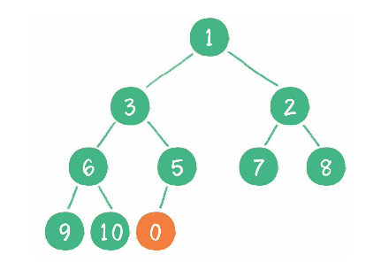

此时新节点 0 比它的父节点 5 小, 于是让新节点"上浮", 即和父节点交换位置.

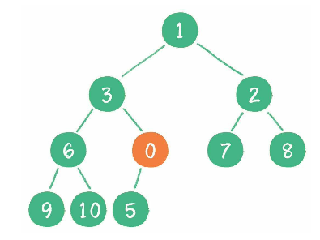

此时新节点 0 比其父节点 3 小, 仍继续"上浮".

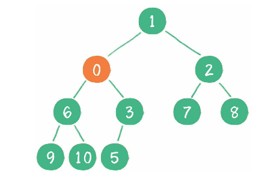

此时新节点 0 比其父节点 1 小, 仍继续"上浮", 结束.

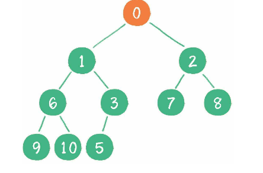

### 删除节点

比如删除根节点 1, 需要先将最后一个节点 10 补位到这个被删除的节点.

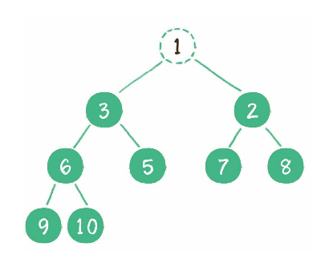
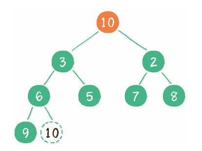

让节点 10 跟它的子节点比较, 发现 10 比最小的子节点 2 还小, 就需要将该节点"下沉"

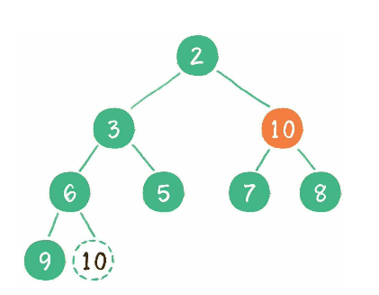

此节点 10 还是比它最小的子节点 7 还小, 继续将该节点"下沉"

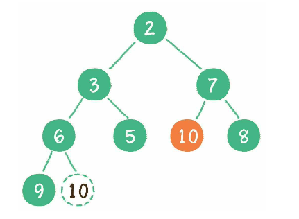

### 构建二叉堆

构建二叉堆, 也就是将一个无序的完全二叉树调整为二叉堆, 本质上就是让**所有非叶子节点"依次下沉"**. 以下面这个完全二叉树为例.

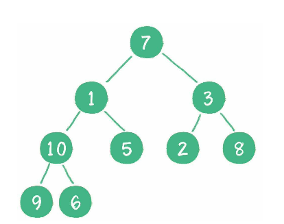

首先从最后一个非叶子节点 10, 因为它大于其子节点最小的节点 6, 那需要将 10 和 6 交换.

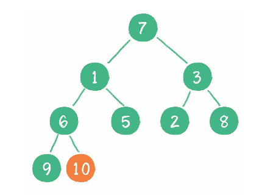

接着从下一个节点 3, 因为它大于其子节点最小的节点 2, 那需要将 3 和 2 交换.

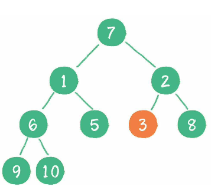

接着从下一个节点 1, 因为它已经小于了其子节点, 故不做交换.

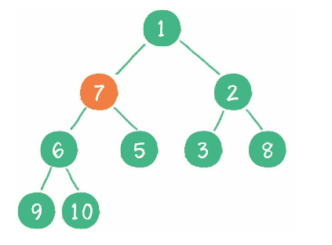

接着从下一个节点 7, 因为它大于其子节点最小的节点 5, 那需要将 7 和 5 交换.

### 实现最小堆

值得注意的是, 二叉堆虽然是一颗完全二叉树, 但它不是采用的链式存储, 而是顺序存储, 换句话说二叉堆的所有节点都存储在数组里.

:::info TIPS
设父节点的数组下标为 `parent`, 那么左孩子的数组下标就为 `parent * 2 + 1`, 右孩子的数组下标就为 `parent * 2 + 2`.
:::

