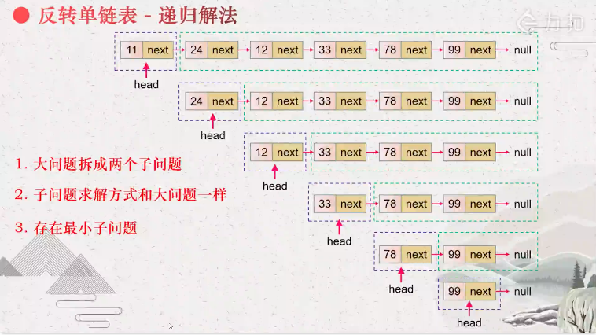

:::success Tips
题目类型: LinkedList

相关题目: [25. k-个一组翻转链表](/leetcode/hard/25-reverse-k-group), [92. 反转链表-ii](/leetcode/medium/92-reverse-between)
:::

## 题目

反转一个单链表.

:::info 示例

输入: 1->2->3->4->5->NULL

输出: 5->4->3->2->1->NULL
:::

## 题解

### 迭代法

对于 `1->2->3->null` 的反转, 实际上就变成了 `null<-1<-2<-3`, 因此初始化一个 prev 为 null, 让:

```ts
curr.next = prev
prev = curr
```

但是 `curr.next = prev` 这句会导致 `curr.next` 丢失了, 因为它已经被赋值给了 `prev`, 因此需要先将 `curr.next` 存储下来, 反转之后将 `curr.next` 赋值给 `curr`.

```ts
/**
 * Definition for singly-linked list.
 * function ListNode(val) {
 *     this.val = val;
 *     this.next = null;
 * }
 */
/**
 * @param {ListNode} head
 * @return {ListNode}
 */
var reverseList = function (head) {
  let prev = null,
    curr = head

  while (curr) {
    const next = curr.next
    curr.next = prev
    prev = curr
    curr = next
  }

  return prev
}
```

时间复杂度：O(n), 其中 n 是链表的长度. 需要遍历链表一次.

空间复杂度：O(1).

### 递归法



我们可以把这个问题拆解成两个子问题, 分别是**头节点**, 以及**头节点后面节点**的反转.

- 递的过程: 一直找到尾部节点
- 归的过程: 以图片中倒数第二个 78(head) -> 99 -> null 为例, 实际上就是将 `head.next.next = head`, 并将 `head.next = null`

```ts
var reverseList = function (head) {
  if (head === null || head.next === null) return head

  const last = reverseList(head.next) // 递的过程: 找到尾部节点

  // 归的过程: 将尾部节点的 next 设为 head
  head.next.next = head
  // 并将 head 的 next 设为 null
  head.next = null

  return last
}
```

时间复杂度：O(n), 其中 n 是链表的长度. 需要对链表的每个节点进行反转操作.

空间复杂度：O(n), 其中 n 是链表的长度. 空间复杂度主要取决于递归调用的栈空间, 最多为 n 层.

## 附: The testing LinkedList instance

```ts
function ListNode(val) {
  this.val = val
  this.next = null
}

const linkedList = new ListNode(1)
linkedList.next = new ListNode(2)
linkedList.next.next = new ListNode(3)
```
