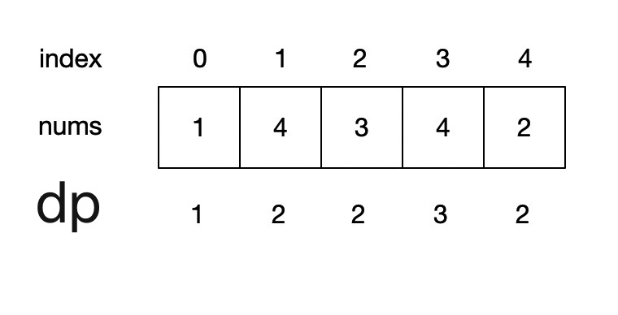
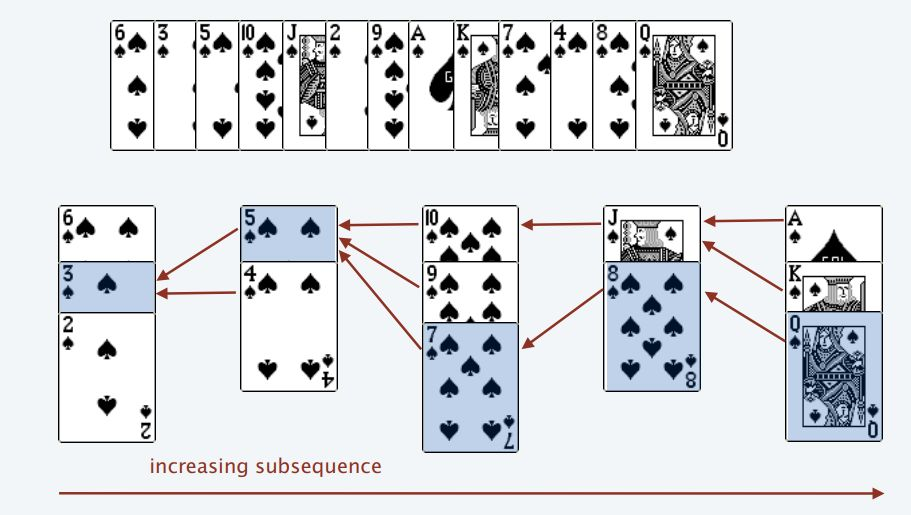

:::success Tips
题目类型: Dynamic Programming, Binary Search

相关题目:

- [673. 最长递增子序列的个数](/leetcode/medium/673-find-number-of-lis)

:::

## 题目

给你一个整数数组 nums, 找到其中最长严格递增子序列的长度. 子序列是由数组派生而来的序列, 删除(或不删除)数组中的元素而不改变其余元素的顺序. 例如, [3,6,2,7] 是数组 [0,3,1,6,2,2,7] 的子序列.

:::info 示例

输入: nums = [10,9,2,5,3,7,101,18]

输出: 4

解释: 最长递增子序列是 [2,3,7,101], 因此长度为 4.
:::

## 题解

以 `nums = [1, 4, 3, 4, 2]` 为例:

- 第一个数字 1 最长递增子序列是 [1], 因此最长长度为 1
- 第二个数字 4 最长递增子序列是 [1, 4], 因此最长长度为 2
- 第三个数字 3 最长递增子序列是 [1, 3], 因此最长长度为 2
- 第四个数字 4 最长递增子序列是 [1, 3, 4], 因此最长长度为 3
- 第五个数字 4 最长递增子序列是 [1, 2], 因此最长长度为 2

我们用肉眼算出了前 5 个数字的最长长度, 但假如 `nums = [1, 4, 3, 4, 2, 3]`, 我们怎么通过前 5 个, 算出第 6 个数的最长递增子序列呢? 其实可以通过再加一个循环, 让 `j < 6`, 即判断如果 `nums[j] < nums[6]`, 说明第 6 个之前还有比 `nums[6]` 小的, 那么最终为 `nums[6]` 的最长递增子序列还可以 + 1, 即 `nums[j] + 1`, 然后 pk `dp[i] 和 dp[j] + 1` 的大小即可.

这个方法的时间复杂度为 O(n<sup>2</sup>).



```ts
/**
 * @param {number[]} nums
 * @return {number}
 */
var lengthOfLIS = function (nums) {
  const n = nums.length
  const dp = new Array(n).fill(1)

  let max = 1
  for (let i = 0; i < n; i++) {
    // j 在 [0, i) 游走, 判断 nums[j] 是否 < nums[i]
    // 如果小于, 说明前面的子序列加上 nums[i] 还可以组成一个新的最长递增子序列
    for (let j = 0; j < i; j++) {
      if (nums[j] < nums[i]) {
        dp[i] = Math.max(dp[i], dp[j] + 1)
      }
    }

    max = Math.max(max, dp[i])
  }

  return max
}
```

## 扩展: 二分查找法



```ts
var lengthOfLIS = function (nums) {
  const n = nums.length
  const top = new Array(n)
  let piles = 0

  for (let i = 0; i < n; i++) {
    let pocker = nums[i]

    let left = 0,
      right = piles

    while (left < right) {
      const mid = Math.floor((left + right) / 2)

      if (top[mid] > pocker) {
        right = mid
      } else if (top[mid] < pocker) {
        left = mid + 1
      } else {
        right = mid
      }
    }

    if (left === piles) piles++
    top[left] = pocker
  }

  return piles
}
```
