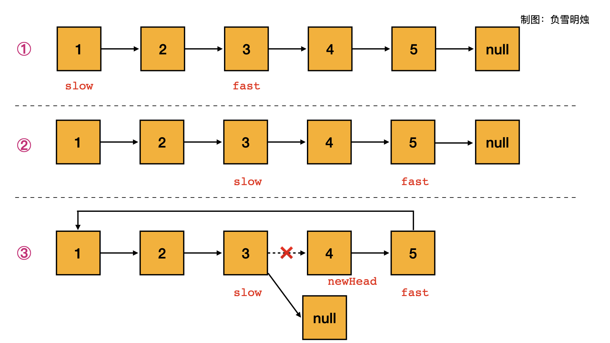

:::success Tips
题目类型: 链表, 快慢指针

相关题目:

- [26. 删除排序数组中的重复项](/leetcode/easy/26-remove-duplicates)
- [27. 移除元素](/leetcode/easy/27-remove-element)
- [83. 删除排序链表中的重复元素](/leetcode/easy/83-delete-duplicates)
- [141. 环形链表](/leetcode/easy/141-has-cycle)
- [142. 环形链表 II](/leetcode/medium/142-detect-cycle)
- [234. 回文链表](/leetcode/easy/234-is-palindrome)

:::

## 题目

给定一个链表, 旋转链表, 将链表每个节点向右移动 k 个位置, 其中 k 是非负数.

:::info 示例

```ts
输入: 1->2->3->4->5->NULL, k = 2
输出: 4->5->1->2->3->NULL
解释:
向右旋转 1 步: 5->1->2->3->4->NULL
向右旋转 2 步: 4->5->1->2->3->NULL
```

```ts
输入: 0->1->2->NULL, k = 4
输出: 2->0->1->NULL
解释:
向右旋转 1 步: 2->0->1->NULL
向右旋转 2 步: 1->2->0->NULL
向右旋转 3 步: 0->1->2->NULL
向右旋转 4 步: 2->0->1->NULL
```

:::

## 题解



1. 首先获取整个链表 head 的长度 len
2. 通过 `k = k % len` 获取最小旋转的 k, 因为题目有的 k 超过了总长度
3. 通过快慢指针的方法找到**倒数第 k 个节点**
4. 通过 `slow.next` 获取 `newHead`
5. 因为 fast 指向了链表的最后, 所以让 `fast.next = head`
6. 让 `slow.next` 设为 null, 目的是断开链表.

```ts
/**
 * Definition for singly-linked list.
 * function ListNode(val) {
 *     this.val = val;
 *     this.next = null;
 * }
 */
/**
 * @param {ListNode} head
 * @param {number} k
 * @return {ListNode}
 */
var rotateRight = function (head, k) {
  if (!head || !head.next) return head

  let curr = head
  let len = 0
  while (curr) {
    curr = curr.next
    len++
  }

  k = k % len

  if (k === 0) return head

  let fast = head,
    slow = head
  while (k) {
    fast = fast.next
    k--
  }

  while (fast.next) {
    fast = fast.next
    slow = slow.next
  }

  const newHead = slow.next
  slow.next = null
  fast.next = head

  return newHead
}
```

## 附录: 剑指 offer - 22. 链表中倒数第 k 个节点

让快指针先走 k 步, 再快慢指针往前一起走, 快指针走到头了, 慢指针就指向了链表中倒数第 k 个节点.

```ts
/**
 * Definition for singly-linked list.
 * function ListNode(val) {
 *     this.val = val;
 *     this.next = null;
 * }
 */
/**
 * @param {ListNode} head
 * @param {number} k
 * @return {ListNode}
 */
var getKthFromEnd = function (head, k) {
  let fast = head,
    slow = head

  while (k > 0) {
    fast = fast.next
    k--
  }

  while (fast) {
    fast = fast.next
    slow = slow.next
  }

  return slow
}
```
